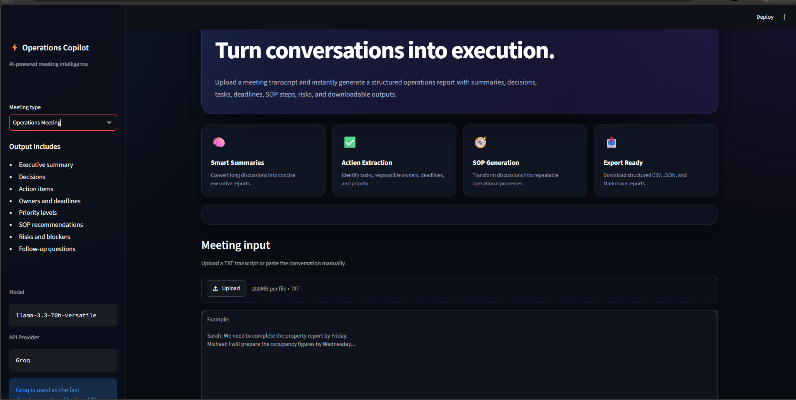
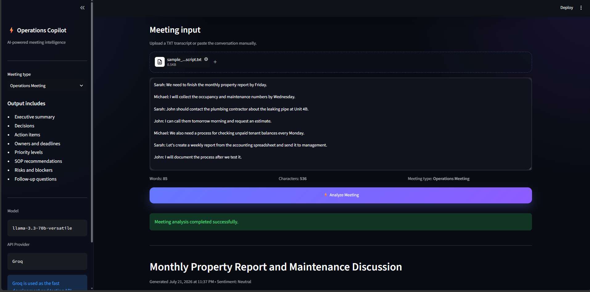
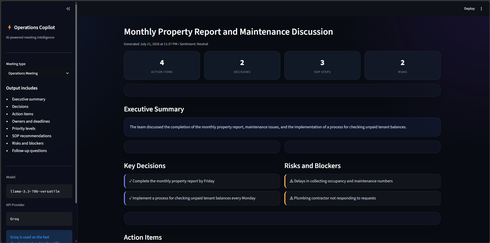
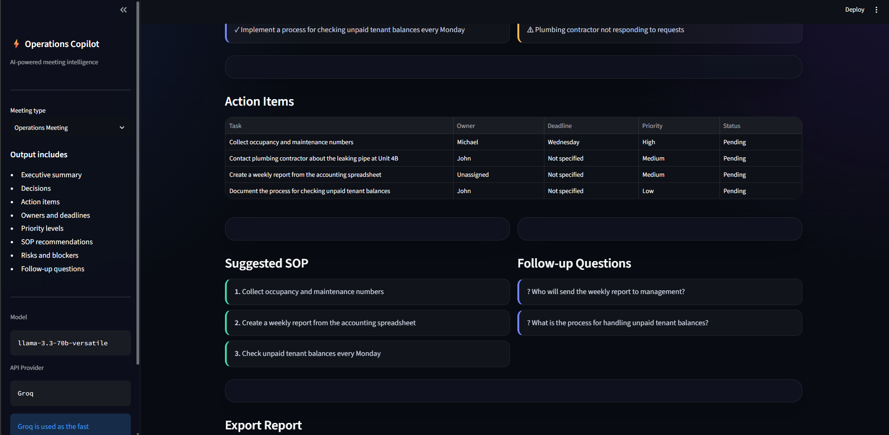
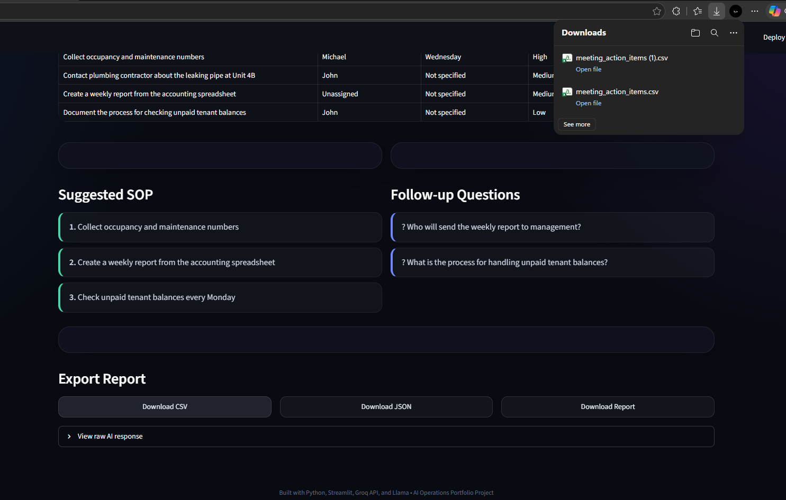

# AI Meeting Operations Assistant

AI Meeting Operations Assistant is a Python application that transforms meeting transcripts into structured operational reports using the Groq API and Llama 3.3.

The application extracts actionable business information including executive summaries, decisions, action items, owners, deadlines, risks, SOP recommendations, and follow-up questions.

---

## Features

- Upload TXT meeting transcripts
- Manual transcript input
- Executive summary generation
- Decision extraction
- Action item tracking
- Owner and deadline identification
- Priority classification
- SOP generation
- Risk and blocker detection
- Follow-up question generation
- Export reports as CSV, JSON, and Markdown

---

# Screenshots

## Dashboard



The landing page provides an overview of the application and supported meeting outputs.

---

## Transcript Analysis



Upload a transcript or paste one manually before sending it to the Groq API for processing.

---

## Generated Report



The generated report includes:

- Executive Summary
- Key Decisions
- Risks and Blockers
- Meeting Statistics

---

## Action Items



Every detected task is organized with:

- Owner
- Deadline
- Priority
- Status

---

## Export Reports



Export the generated meeting report as:

- CSV
- JSON
- Markdown

---

# Technology Stack

- Python
- Streamlit
- Groq API
- Llama 3.3 70B
- Pandas
- python-dotenv

---

# Installation

Clone the repository:

```bash
git clone https://github.com/Emils18/ai-meeting-operations-assistant.git
cd ai-meeting-operations-assistant
```

Create a virtual environment:

```bash
python -m venv venv
```

Activate it (Windows):

```bash
venv\Scripts\activate
```

Install the dependencies:

```bash
pip install -r requirements.txt
```

Create a `.env` file:

```env
GROQ_API_KEY=your_groq_api_key
```

Run the application:

```bash
streamlit run app.py
```

Open:

```
http://localhost:8501
```

---

# Sample Use Case

A property management company can upload a meeting transcript and automatically generate:

- Executive summary
- Action items
- Assigned owners
- Deadlines
- Risks
- SOP recommendations
- Follow-up questions
- Exportable reports

---

# API Provider

The application uses the Groq API with Llama 3.3 for development and testing. The architecture can be adapted to other LLM providers if needed.

---

# Author

**Emelio Mondares**

GitHub: https://github.com/Emils18

Portfolio: https://portfolio-final-ten-gold.vercel.app/
